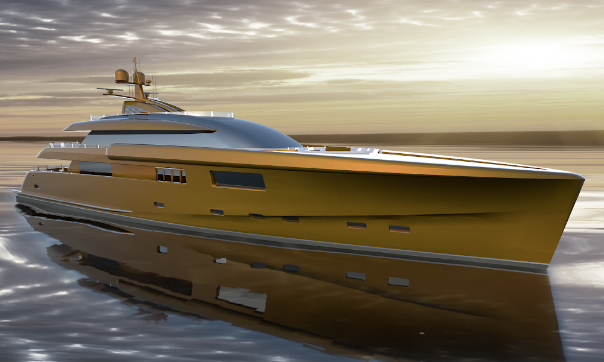

# Gregory Marshall - Miami Collection

设计了一些世界上最好的超级游艇，游艇设计公司 Gregory C. Marshall Naval Architect Ltd. 已经建立了世界顶级造船公司之一的声誉。35 多年来，创始人格雷格·马歇尔 (Greg Marshall) 和他的商业伙伴、海军建筑师戈登·加尔布雷思 (Gordon Galbraith) 为各种客户设计了越来越大的超级游艇和商业工艺。与任何毕生的梦想一样，它很早就从格雷格开始了。

格雷格的父亲、维多利亚建筑师多诺万·马歇尔认识到了他儿子的痴迷，并将他介绍给了著名的游艇设计师比尔·加登。加登请 15 岁的格雷格为一位顾客画一艘游艇。格雷格制作了一批图纸，当机会出现时，加登在高中毕业后为他提供了几周的起草工作。在 Bill Garden 的 6 年指导下，Greg 积累了至今仍为他服务的游艇设计技巧和实用方法。

