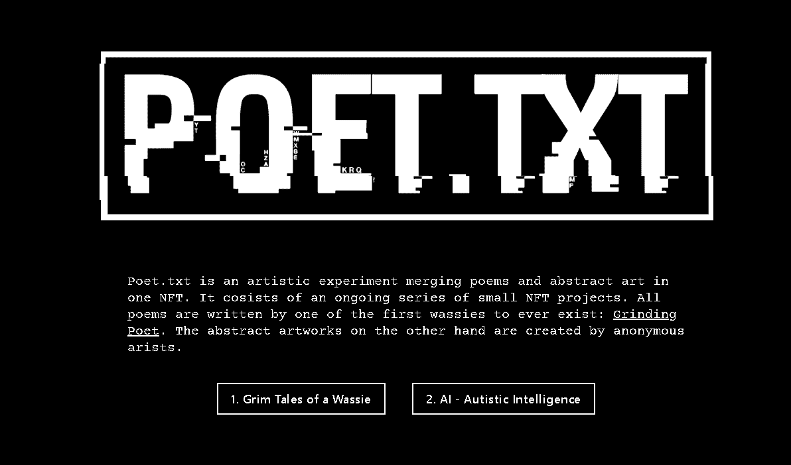

# Grim Tales of a Wassie

“Wassie 的恐怖故事”包含 111 幅独特的抽象艺术作品和 111 首诗歌。诗歌和艺术作品的独特组合由 Crypto Twitter 上著名的 smol wassie [研磨诗人] 精心策划。

Poet.txt 是一项将诗歌和抽象艺术融合在一个 NFT 中的艺术实验。它由一系列正在进行的小型 NFT 项目组成。所有的诗都是由有史以来最早的一位诗人写的：研磨诗人。另一方面，抽象艺术作品是由匿名艺术家创作的。

