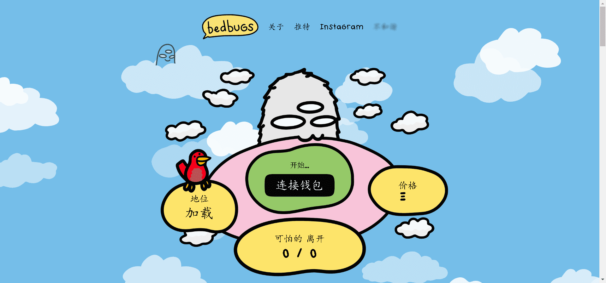

# grimbogs by bedbugs

“臭虫”是一个建立在和平地融入社会的基础上，同时以积极的态度将它们带入公众意识的组织。臭虫已经为那些相信 grimbogs 提供的无限可能性的人们部署了 10,000 个会员 NFT。

搜索人员被部署在世界各地，并返回了大量数据和更多答案。他们发现，在我们的眼皮底下，冷猿正在我们的社会中同化。一些人当时非常害怕冷魔，而另一些人则想在体面的社会中为自己的权利而战。

随后，*臭虫创建*了一个支持 grimbog 的团体，该组织建立了一个由 10,000 人组成的网络，致力于消除对 grimbogs 的常见误解。

