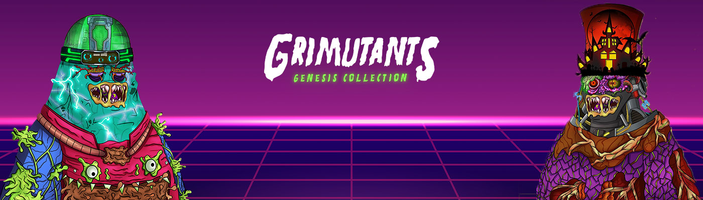

# Grimutants Genesis Collection (GGC)

Grimutants Genesis Collection 包含 3,333 种怀旧紫色吉祥物的变异版本。这些突变体存在于以太坊网络上，由 100 多个属性特征创建。NFT 艺术本身是在薄荷时以随机生成的方式制作的，除了收藏中内置的 33 件超稀有物品。但是，您的 Grimutant 不仅仅是一件艺术品。这些代币是该实用程序的基础，该实用程序将内置到其原生 $GRIM 代币的生态系统中。对未来 NFT 收藏的独家访问权、被动收入抵押、Play-to-Earn 游戏，甚至与 Metaverse（称为 GRIMAVERSE）相关的福利都将与这个创世收藏密切相关。开发团队的重点是为其社区提供有形的区块链实用程序、接触 Web3 应用程序以及绝对令人惊叹的艺术品。

