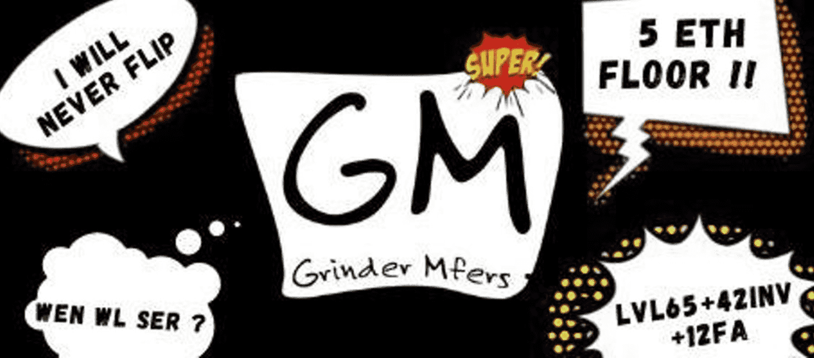

# Grinder Mfers

6,969 名 Grinder Mfer 生活在以太坊区块链上。一群讨厌磨砺和构建全新方式的mfer。来自很棒的#sartoshi 的衍生项目

▶ 什么是研磨机 Mfers？
Grinder Mfers 是一个 NFT（非同质代币）集合。存储在区块链上的数字艺术品集合。

▶ 有多少 Grinder Mfers 代币？
总共有 3,151 个 Grinder Mfers NFT。目前，523 位所有者的钱包中至少有一个 Grinder Mfers NTF。

▶ 最昂贵的 Grinder Mfers 销售是什么？
出售的最昂贵的 Grinder Mfers NFT 是 Grinder Mfer #1701。它于 2022-06-10（3 个月前）以 21.2 美元的价格售出。

