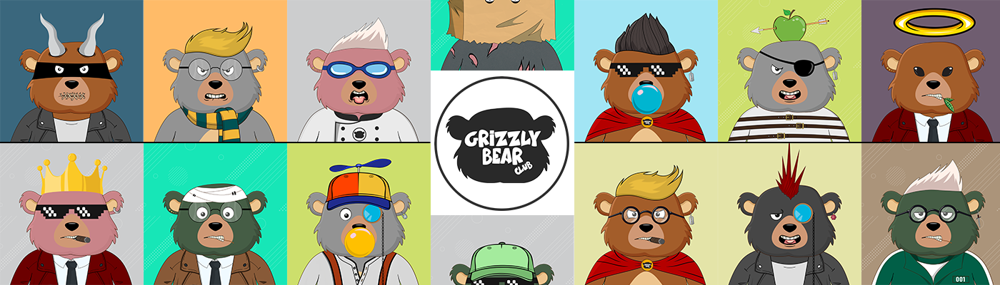

# Grizzly Bear Club (GBC)

Grizzly Bear 是 10,000 个独特 NFT 的集合，在 Polygon 区块链上的 ERC-721 标准中随机生成了 +250k 可能的组合。

灰熊俱乐部 (GBC) NFT - 常见问题 (FAQ)
▶ 什么是灰熊俱乐部 (GBC)？
灰熊俱乐部 (GBC) 是一个 NFT（不可替代代币）集合。存储在区块链上的数字艺术品集合。
▶ 灰熊俱乐部 (GBC) 代币有多少？
总共有 5,212 个灰熊俱乐部 (GBC) NFT。目前，79 位所有者的钱包中至少有一个灰熊俱乐部 (GBC) NTF。
▶ 最近卖出了多少灰熊俱乐部（GBC）？
过去 30 天内售出 0 个灰熊俱乐部 (GBC) NFT。

