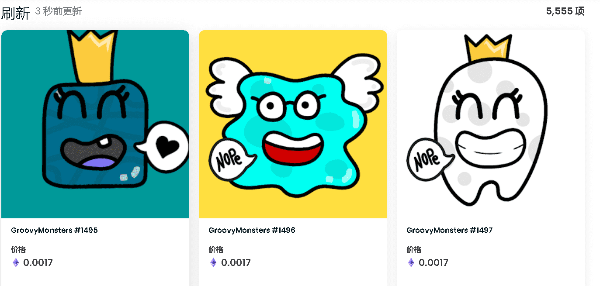

# GroovyMonsters

▶ 什么是 GroovyMonsters？
GroovyMonsters 是一个 NFT（非同质代币）集合。存储在区块链上的数字艺术品集合。

▶ 有多少 GroovyMonsters 代币？
总共有 5,555 个 GroovyMonsters NFT。目前，32 位所有者的钱包中至少有一个 GroovyMonsters NTF。

▶ 最近卖出了多少 GroovyMonster？
过去 30 天内共售出 1 个 GroovyMonsters NFT。

