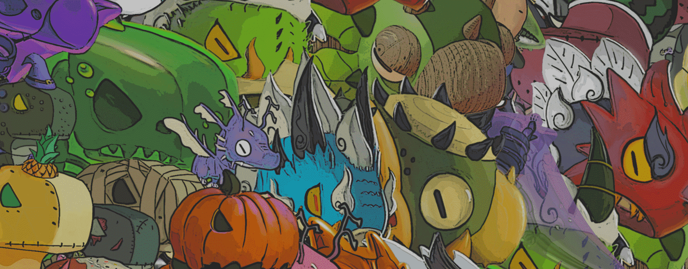

# Grumpii Monsters

Grumpii 原始怪物。

▶ 什么是 Grumpii 怪兽？
Grumpii Monsters 是一个 NFT（非同质代币）系列。存储在区块链上的数字艺术品集合。

▶ 有多少 Grumpii Monsters 代币？
总共有 9 个 Grumpii Monsters NFT。目前，78 位所有者的钱包中至少有一个 Grumpii Monsters NTF。

▶ 最近卖出了多少 Grumpii Monsters？
过去 30 天内共售出 1 个 Grumpii Monsters NFT。

