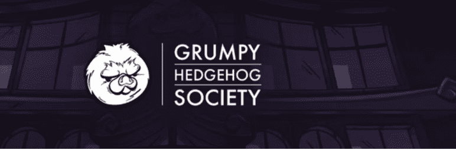

# Grumpy Hedgehog Society | GHS

脾气暴躁的刺猬协会 | GHS NFT - 常见问题（FAQ）
▶ 什么是脾气暴躁的刺猬协会 | 全球统一制度？
脾气暴躁的刺猬协会 | GHS 是一个 NFT（不可替代代币）集合。存储在区块链上的数字艺术品集合。
▶ 多少脾气暴躁的刺猬社 | GHS 代币存在吗？
总共有 2,222 个脾气暴躁的刺猬协会 | GHS NFT。目前 464 位业主拥有至少一个脾气暴躁的刺猬协会 | GHS NTF 在他们的钱包里。
▶ 什么是最贵的暴躁刺猬协会 | 全球统一制度销售？
最贵的脾气暴躁刺猬社| 出售的 GHS NFT 是 Grumpy Hedgie #66。它于 2022-06-08（3 个月前）以 27.2 美元的价格售出。
▶ 多少脾气暴躁的刺猬社 | GHS 最近卖了？
有3个脾气暴躁的刺猬协会| 过去 30 天内售出的 GHS NFT。

