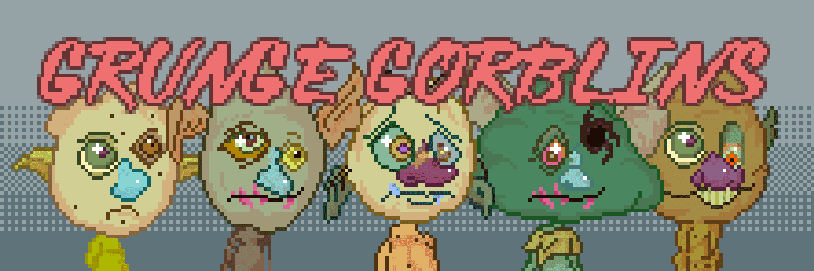

# Grunge Gorblins

Grunge Gorblins NFT - 常见问题（FAQ）
▶ 什么是 Grunge Gorblins？
Grunge Gorblins 是一个 NFT（非同质代币）集合。存储在区块链上的数字艺术品集合。
▶ 存在多少 Grunge Gorblins 代币？
总共有 333 个 Grunge Gorblins NFT。目前，217 位车主的钱包中至少有一个 Grunge Gorblins NTF。
▶ 最近卖出了多少 Grunge Gorblins？
过去 30 天内售出 0 个 Grunge Gorblins NFT。
▶ 流行的 Grunge Gorblins 替代品有哪些？
许多拥有 Grunge Gorblins NFT 的用户还拥有 Knot Okay Bears NFT、 PSYCOZ ESPORTS、 NotBanksyDove和 0EProgrammed。

