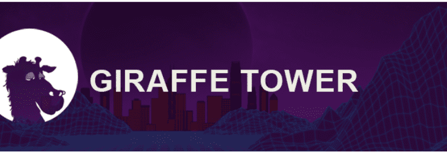

# Giraffe Tower Baby

长颈鹿塔 NFT - 常见问题（FAQ）
▶ 什么是长颈鹿塔？
Giraffe Tower 是一个 NFT（非同质代币）集合。存储在区块链上的数字艺术品集合。
▶ 有多少个 Giraffe Tower 代币？
总共有 9,934 个 Giraffe Tower NFT。目前，734 位业主的钱包中至少有一个 Giraffe Tower NTF。
▶ 什么是最昂贵的长颈鹿塔销售？
售出的最昂贵的 Giraffe Tower NFT 是 Giraffe #9004。它于 2022-07-28（30 天前）以 703.5 美元的价格售出。
▶ 最近卖出了多少个长颈鹿塔？
过去 30 天内售出了 31 个 Giraffe Tower NFT。
▶ 长颈鹿塔要多少钱？
在过去 30 天内，最便宜的 Giraffe Tower NFT 销售额低于 101 美元，最高销售额超过 269 美元。过去 30 天内，Giraffe Tower NFT 的中位价格为 183 美元。
▶ 什么是流行的长颈鹿塔替代品？
许多拥有 Giraffe Tower NFT 的用户还拥有 Giraffe Tower Offspring、 The Royals、 Party Grandpa | 退休俱乐部和 CCC创世纪包装-赶集。

