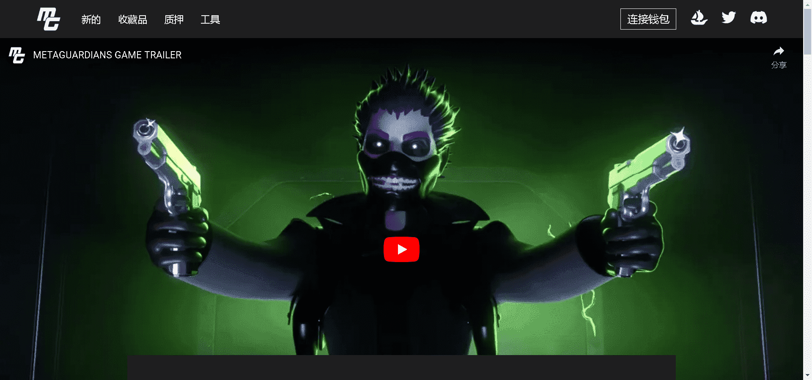

# Guardians of the Metaverse

Metaguardians 是 10,000 个独特的 3D 英雄般化身的集合，这些化身在区块链上以 NFT 的形式存在。监护人作为 ERC721 代币存储在以太坊区块链上。

Guardians 不仅是设计的人物收藏品，它们还可以作为您进入独家内容世界的门票。从开发新系列来填充我们的宇宙，到虚拟世界头像，当然还有我们即将推出的新 P2E 游戏！

Metaguardians 是一款由屡获殊荣的《植物大战僵尸》设计师领导的游戏即赚钱手游和 PC 游戏。该游戏利用区块链技术为玩家提供强大的生态系统。

Metaguardians 拥有不同的派系，您可以通过拥有至少 1 个 NFT 的收藏品来加入！

