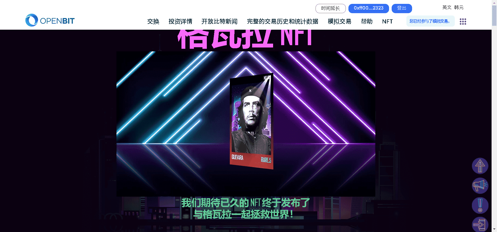

# guevara2-nft-test

存在于 OPENBIT 中的 10,000 名革命者决心获得过去存在的传奇革命者的力量，以便在他们声称的革命中获得更大的权力。

革命（原始）和血清可以合成（焚化）以获得革命（觉醒）。

1. 革命血清由于每种独特的效果而具有稀有性，无论编号如何，都是随机确定的。

   2.血清根据其稀有度改变革命者的外观并增加稀有度。

   3、革命者可以根据稀有度的增加获得更多的强化奖励。

