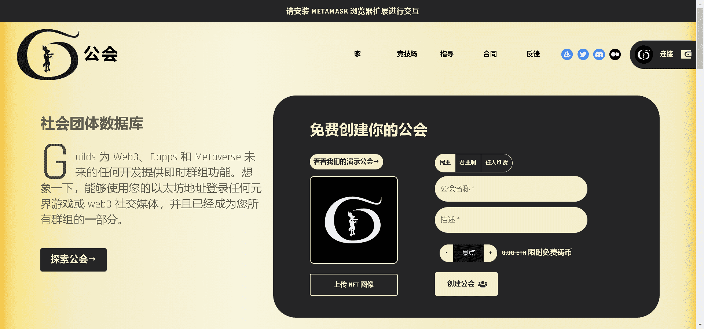

# Guilds NFT

Guilds 既是 web3 和 Metaverse 中发生的发展的社会团体数据库，也是同类众筹概念中的第一个。

Guilds 为 Web3、Dapps 和 Metaverse 未来的任何开发提供即时群组功能。想象一下，能够使用您的以太坊地址登录任何元界游戏或 web3 社交媒体，并且已经成为您所有群组的一部分。

民主/君主制公会大师可以通过烧毁公会 NFT 点（代币）并将其发送到零地址来踢公会成员。

