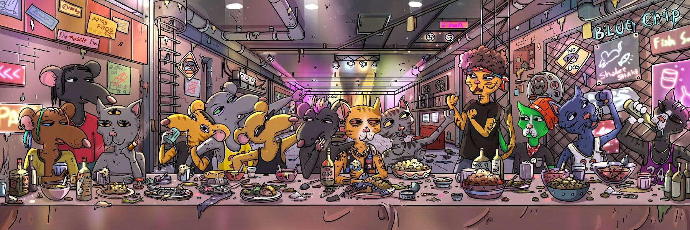

# Gutter Art

Gutter Art NFT 在过去 7 天内售出 22 次。Gutter Art 的总销售额为 175.93 美元。一份 Gutter Art NFT 的平均价格为 8 美元。有 7,126 名 Gutter Art 所有者，总共拥有 32 个代币。

Gutter Art NFT - 常见问题（FAQ）
▶ 什么是天沟艺术？
Gutter Art 是一个 NFT（非同质代币）集合。存储在区块链上的数字艺术品集合。
▶ 存在多少 Gutter Art 代币？
总共有 32 个 Gutter Art NFT。目前，7,126 位业主的钱包中至少有一个 Gutter Art NTF。
▶ 最昂贵的 Gutter Art 拍卖会是什么？
售出的最昂贵的 Gutter Art NFT 是 GCG X Pop Wonder。它于 2022-08-13（14 天前）以 24.6 美元的价格售出。
▶ 最近卖出了多少 Gutter Art？
过去 30 天内售出了 86 个 Gutter Art NFT。
▶ Gutter Art 需要多少钱？
在过去 30 天里，最便宜的 Gutter Art NFT 销售额低于 4 美元，最高销售额超过 14 美元。过去 30 天内，Gutter Art NFT 的中位价格为 6 美元。
▶ 流行的 Gutter Art 替代品有哪些？
许多拥有 Gutter Art NFT 的用户还拥有 Cool Cats Events、 Robotos Originals、 The Flower Girls: Special Editions和 WVRPS Drops。

