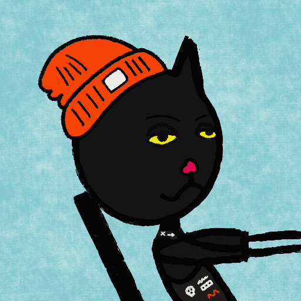

# gutter mfers

排水沟mfers统计
创建于 6 个月前
6,968 代币供应
6.9% 费用
过去 7 天没有售出排水沟 mfer。

我们是排水沟mfers

还没有官方的不和谐，也没有发布路线图，只是一群在阴沟里乱动的 mfer！

在了解了 sartoshi 的 mfer 的使命和可用性之后，我和姐姐决定展示生活在阴沟里的最疯狂的 mfer！

▶ 什么是排水沟mfers？
gutter mfers 是一个 NFT（非同质代币）集合。存储在区块链上的数字艺术品集合。
▶ 存在多少个 gutter mfers 代币？
总共有 6,968 个 gutter mfers NFT。目前，321 位业主的钱包中至少有一个 gutter mfers NTF。
▶ 什么是最昂贵的排水沟 mfers 销售？
NFT 出售的最昂贵的 gutter mfers 是 gutter mfer #2494。它于 2022-06-11（3 个月前）以 16 美元的价格售出。
▶ 最近卖了多少天沟mfer？
过去 30 天内售出了 1 个 gutter mfers NFT。

