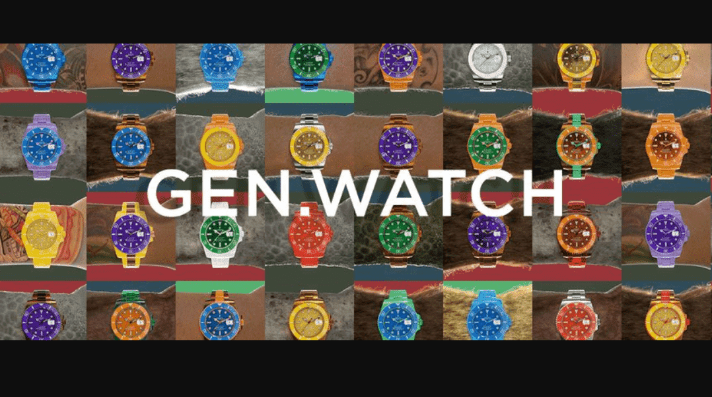

# GW Daitona Drop [SOLD OUT secondary market on gen.watch]

这是官方的 Gen Watch Drop 页面。单击下面的唯一项目。在列表下，您将能够在手表上线后铸造手表。今天 [1 月 25 日] 将有 25 只 OHMega Speedmeista 手表可供铸造。

Generative Watches 将是一个由 1,000 个算法生成、经过美学设计的奢华腕表组成的数字系列。向你的追随者、你的朋友、你的妈妈们展示一下。请注意，有些人比其他人更难弯曲。

▶ 什么是 Gen 手表？
Gen Watch 是一个 NFT（不可替代代币）集合。存储在区块链上的数字艺术品集合。

▶ 有多少 Gen Watch 代币？
总共有 235 个 Gen Watch NFT。目前，109 位车主的钱包中至少有一个 Gen Watch NTF。

