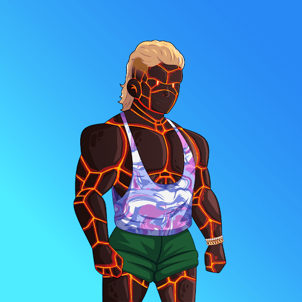

# GYMBROs Official

GYMBROs NFT 是 10,000 个独特的、数字化掌握的化身，它们在以太坊区块链上积极提升。您的 BRO 兼作 GYMBROs 生态系统的会员，其中包括 GYMBROs 总部和健身房（澳大利亚黄金海岸 - 2022 年）以及 GYMBROs 商店 - 澳大利亚运动服品牌。持有人将有权获得巨大的利益，包括：

免费使用 GYMBROs 健身房
GYMBROs 商店的免费季节性商品掉落
GYMBROs Online Store 的所有订单均可享受 50% 的折扣
免费空投，仅限 GYMBROs **持有者**,人类发现了地球进入双曲时间室的入口。室内一年相当于室外一天。

被认为可以安全使用，入口对任何希望使用它的人开放。现在，您的许多日常健身者都被不必要地劫持了。这个超级buff类人生物社区被亲切地称为GYMBRO。

GYMBRO 没有意识到什么？为密室提供动力的宇宙能量正在改变那些在里面呆太久的人的 DNA——有些是好的，有些，嗯，不是那么多……

