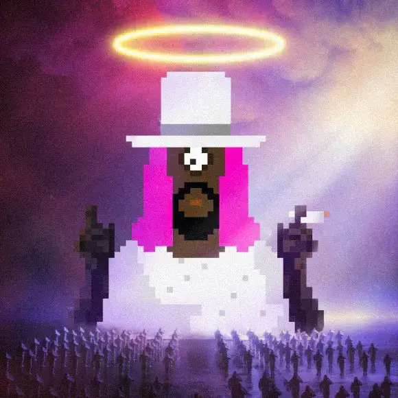

# GZY First Come

什么是 KRYPTOCHURCH
KryptoChurch 是一个由建设者和创造者驱动的启蒙秘密社团。在我们信任的区块链中。只有区块链之子GZY的所有者才能进入社会。元宇宙
我们正在通过制作出色的东西在两个现实中建立技术宗教 - 在线和现实世界。然后 KryptoChurch 的 DAO 成员决定下一步做什么——并成为其中的一部分。永永远远。阿门。

认识GZY
与我同行，兄弟姐妹

GZY 是区块链的儿子，区块链是存储在以太坊上的 48x48 像素像素艺术品。GZY NFT 受限于 10k NFT 图像，每张图像都是由混合特征生成的。所有 GZY 都很酷，但其中一些是罕见的，并且可以解锁社区通过激活路线图解锁的特权。

KryptoChurch 的原则是基于 GZY 的生活和教义，并记录在圣经中。

