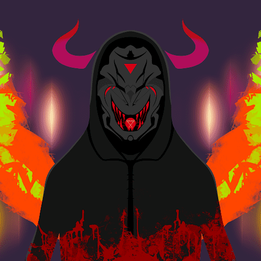

# H1VE

3,333 名尼拉迪亚人使用 H1VEMIND 密谋对付 H1VE 猎人。拥有它们会将它们永远困在区块链中，或者是吗？▶ 什么是 H1VE？
H1VE 是一个 NFT（Non-fungible token）集合。存储在区块链上的数字艺术品集合。
▶ 有多少 H1VE 代币？
总共有 2,105 个 H1VE NFT。目前，422 位所有者的钱包中至少有一个 H1VE NTF。
▶ 最昂贵的 H1VE 销售是什么？
售出的最昂贵的 H1VE NFT 是 H1VE Niladian #1980。它于 2022 年 6 月 23 日（2 个月前）以 5.5 美元的价格售出。
▶ 最近卖了多少H1VE？
过去 30 天内售出了 2 个 H1VE NFT。
▶ 什么是流行的 H1VE 替代品？
许多拥有 H1VE NFT 的用户还拥有 DerpDerp DerpDerp、 Wicked Craniums Comic、 Char0和 Toy Frens。

