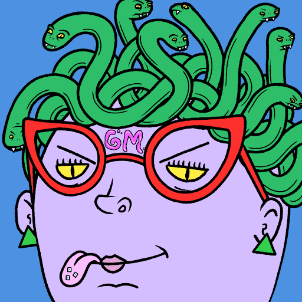

# h8rschix

h8rschix 统计
创建于大约 2 个月前
10,067 代币供应
5% 费用
h8rschix NFT 在过去 7 天内售出 125 次。h8rschix 的总销售额为 1.22 万美元。一个 h8rschix NFT 的平均价格为 9.8 美元。有 1,587 个 h8rschix 所有者，拥有 10,067 个代币的总供应量。

我们h8你的故事，快来创作吧。▶ 什么是 h8rschix？
h8rschix 是一个 NFT（不可替代令牌）集合。存储在区块链上的数字艺术品集合。
▶ 有多少 h8rschix 代币？
总共有 10,067 个 h8rschix NFT。目前，1,587 位所有者的钱包中至少有一个 h8rschix NTF。
▶ 最昂贵的 h8rschix 销售是什么？
出售的最昂贵的 h8rschix NFT 是 h8rs chix #1816。它于 2022-07-03（大约 2 个月前）以 54.9 美元的价格售出。
▶ 最近卖了多少h8rschix？
过去 30 天内售出了 125 个 h8rschix NFT。

