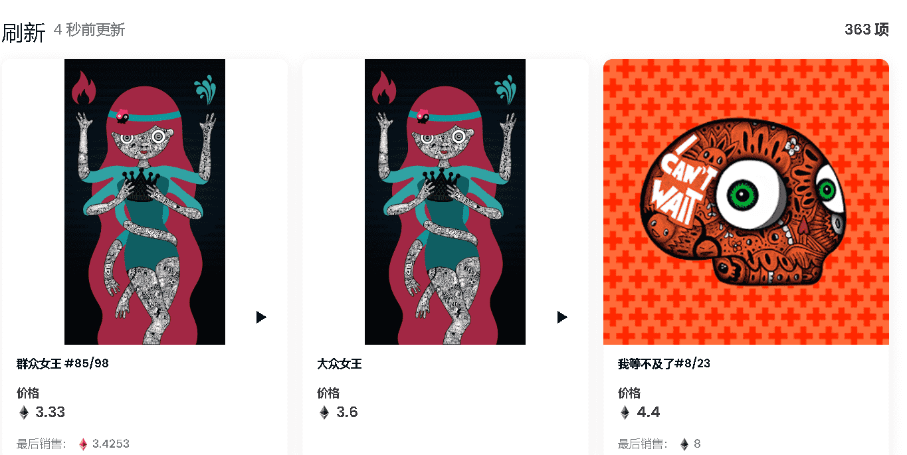

# Hackatao

'Hack' 是为了享受深入皮肤并发现隐藏在里面的乐趣；'道'为阴阳，创造动态平衡。Hackatao 的艺术作品经常涉及社会、环境、人类和加密等主要问题，以及对艺术史、象征主义和心理学的参考。

▶ 什么是 Hackatao？
Hackatao 是一个 NFT（Non-fungible token）集合。存储在区块链上的数字艺术品集合。

▶ 有多少 Hackatao 代币？
总共有 363 个 Hackatao NFT。目前 172 位所有者的钱包中至少有一个 Hackatao NTF。

▶ 最昂贵的 Hackatao 销售是什么？
售出的最昂贵的 Hackatao NFT 是 Queen of Silence #3/5。它于 2022 年 8 月 4 日（30 天前）以 1.41 万美元的价格售出。

