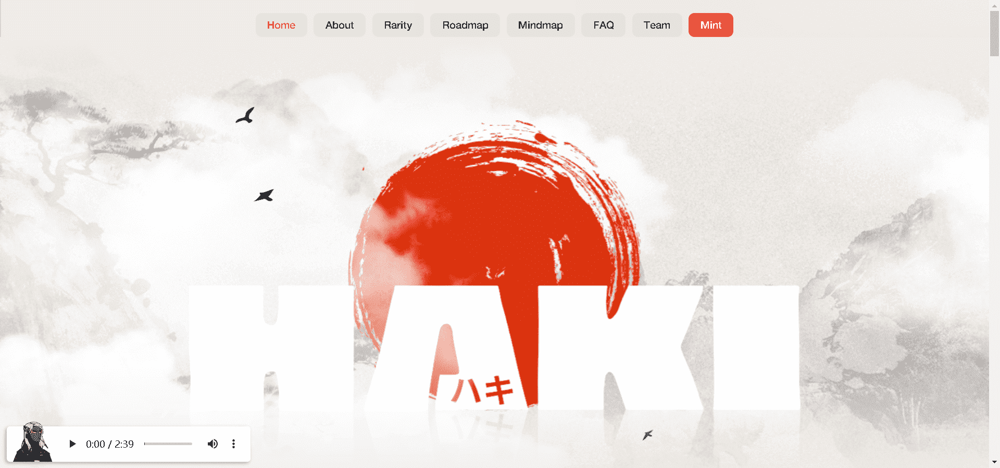

# HAKI NFT

5,000 个独特的 HAKI 集合，旨在超越数字空间，为我们的社区带来众多好处，从我们的街头服饰、NFT 空投、现场活动、持有人实用程序等开始，随着我们旅程的进展！

什么是霸气
HAKI 是 5,000 个 NFT 的集合，灵感来自日本漫画和动漫中人物的精神和活力。每个 HAKI 都被赋予了独特的生命力，気（'Ki'），象征着他或她的力量和抱负。HAKI 的持有者将成为神社的一部分，拥有强大的社区、街头服饰、商品和我们独特的 Metaverse 的独家访问权。

