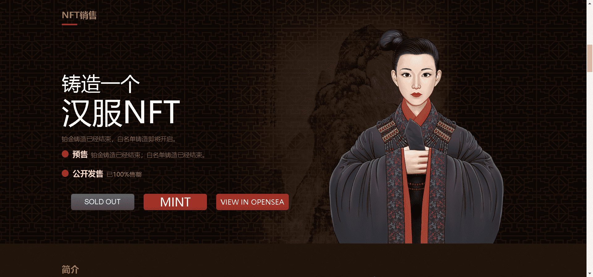

# HanfuNFT

5200手绘东方古典美学NFT。是打开东方艺术世界的通行证！这是一件历时八个月完成的收藏级艺术品，是东方古典美学与现代艺术的融合。以后的神秘特权将只保留给我们的持有者！

当然我们要做的仅仅是一件漂亮衣服NFT么？不是，我们以此为起点，向世界介绍华夏几千年的智慧和哲学，这是对当下中国文化忧患思潮一个极好的概括。

很多人在寻找，而我们这个群体找到的答案，先是一袭尘封已久的衣冠，拭去血迹和尘埃以后，衣冠上显出的字迹叫做“华夏”。这正是千千万万汉服爱好者和从业者的初衷。

