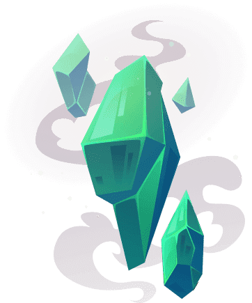

# Hanging Heads Official

吊头，2,222 个悬挂骷髅的独一无二的集合！Hanging Heads 的起源可以追溯到中世纪，当时有维京人沿着冰岛一条黑暗阴森的泥土小道旅行，到处都是维京人昔日对手的骷髅。在沿着这条小径旅行时，维京人遇到了一个叫做骷髅谷的地方。据说这个神秘的山谷被诅咒着罪恶。维京人现在了解到，传闻中，如果他们砍下一个骷髅的头颅，诅咒就会失效。从那时起，任何经过骷髅谷的维京人都会用他们的大斧头砍掉骷髅的头。我们在山谷中发现了这些被斩首的古代骷髅，并决定在以太坊区块链上保留它们的存在。但是一天晚上发生了一些奇怪的事情，这些保存下来的头骨的头开始做一些奇怪的事情。他们开始颤抖，嘎嘎作响，他们的眼睛开始发光。甚至有报道说，一个骷髅说“我们要报仇……”共供应2,222个吊头！每个钱包允许的薄荷糖将很快公布。

