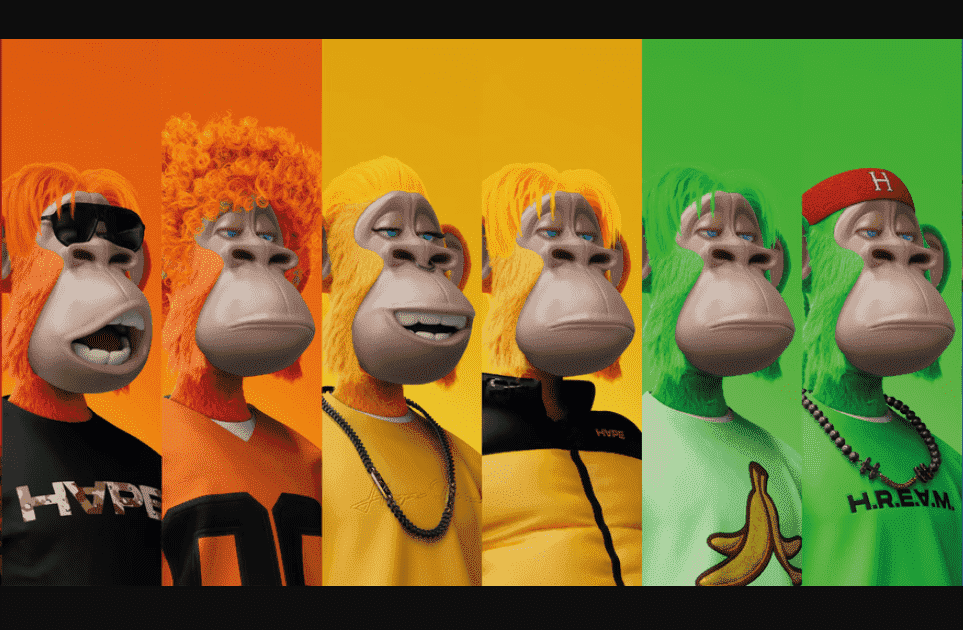

# HAPE Prime

独特的，完全 3D 的，旨在统一猿多元宇宙。由 Digimental 设计和设计。

▶ 什么是 HAPE PRIME？
HAPE PRIME 是一个 NFT（非同质代币）集合。存储在区块链上的数字艺术品集合。

▶ 有多少 HAPE PRIME 代币？
总共有 8,192 个 HAPE PRIME NFT。目前，4,438 位所有者的钱包中至少有一个 HAPE PRIME NTF。

▶ 最昂贵的 HAPE PRIME 销售是什么？
最昂贵的 HAPE PRIME NFT 是 HAPE #966。它于 2022 年 7 月 2 日（2 个月前）以 870 美元的价格售出。

▶ 最近卖出了多少HAPE PRIME？
过去 30 天内售出了 478 个 HAPE PRIME NFT。

