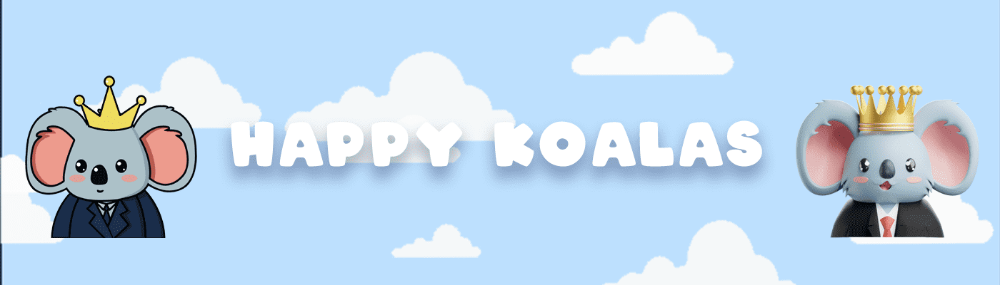

# Happy Koalas

该项目具有非常独特的代币经济学：

1. 进化到 3D 版本（如果需要，可以在有限的时间内切换回 2D）
2. 通过有趣的社区活动获得稀有毛皮的能力，实际上可以应用于您的考拉！

这些是 Genesis NFT 的一个有趣且不断发展的项目。这些 NFT 充当 Koalaverse 生态系统的 VIP 通行证，并为 Koalaverse: Chummies 提供免费保留薄荷糖等福利！6,666 只具有独特代币经济学的不断进化的考拉，2 月 15 日铸造 3D
你的考拉将进化成高质量的 3D 版本。元界
每只考拉都将拥有自己的体素化身，用于沙盒虚拟世界。公开铸币厂的价格是多少？
每笔交易的最大薄荷糖？
每笔 10 只快乐考拉
会有白名单吗？ 如果是这样，我该如何访问它？

是的。 WL 薄荷糖更便宜，而且比六小时前更便宜。 白名单已关闭。

