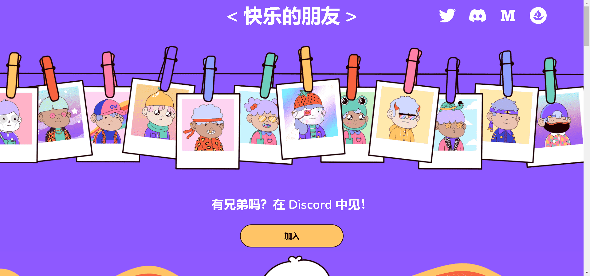

# Happy Homies NFT

6500 位兄弟肩负着在整个元界传播欢乐的使命。Chichi 和 Duro 用爱创造。

Happy Homies 是 6500 个 Homies 的集合，他们心中有一个目标；在整个元节中传播欢乐和积极性。它们是从330 种特征的混合中精心生成的。每一个都比下一个更时尚。

我们希望每个人都能找到与他们相关的朋友，这让他们感到快乐并且他们可以代表自己。

兄弟们富有创造力、热情、快乐并为自己铺平道路。我们希望通过赋予社区 CC0 对 Homies 的权利来鼓励这一点。Happy Homies 项目也有 0% 的版税。

