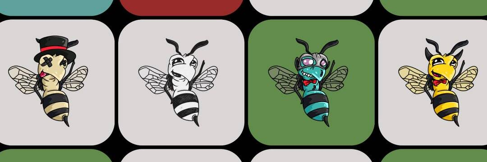

# Happy Hornets

• Pollination DAO 将对 Polygon 区块链上的新 NFT 项目进行投资。我们将在项目所有者公开发布之前与他们合作，以确保通过 Pollination DAO 的资金购买支持这些新项目的初始 NFT 交易。
• Pollination DAO 在有希望的新项目上将具有先发优势。这有可能进一步为 Pollination DAO 提供资金，并有可能通过 Pollination DAO 获得的这些项目的转售资金奖励 Pollination DAO 成员。
• 是否投资新项目的所有选择都将由 Pollination DAO 成员投票决定。
• 在这些新项目的初始投资中，关于转售定价的所有选择都将由 Pollination DAO 成员进行投票。
• 所有关于进一步资助授粉DAO 或将资金分配给授粉DAO 成员的选择都将由授粉DAO 成员进行表决。• 第 4 阶段将在第 3 阶段完成后开始，并且处于授粉 DAO 内的迭代投资阶段。
• 第4 阶段将由Happy Hornets & Pollination DAO 持有者决定。目前选项尚不清楚，但随着项目进入下一阶段的发展，我们将向 Pollination DAO 成员提出几个想法。

