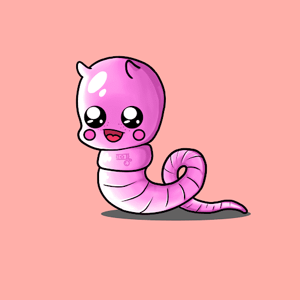

# HappyLand Wummy Gurms

HappyLand Wummy Gurms 是 4,000 条可爱的软糖蠕虫的集合，它们来自最初的 HappyLand 小熊软糖系列。它们被用作小熊软糖的迷你陪伴代币，具有很快被发现的附加好处和实用性。*（100% 二级市场版税捐给蠕虫持有者委托的慈善机构）*,HappyLand 由 ScaryKid 创建，是 9,600 个独特的 Gummy Bear NFT 的集合。
尽管被现实生活打败了，但还是收养一只小熊软糖，加入一个专注于韧性、坚忍、积极和为世界做好事的社区。小熊软糖及其特征代表了我们所有人在生活中的某个时刻或某个时刻所面临的艰辛感，而熊的面孔则显示出希望、坚忍和坚韧的迹象。有好有坏，最终造就了我们。

HappyLand 是关于我们可以朝着快乐、幸福和变得更有弹性的生活所取得的进步，无论是几天、几周或几年后。这个社区是一个共享的群体，这些弱点相互关联，同时将同情心和温柔延伸到他人身上。

