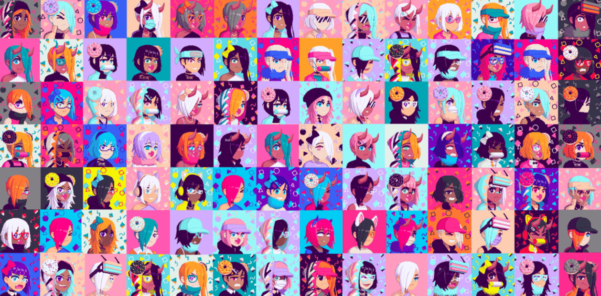

# Harakai!

777 名时尚学徒在区块链上留下了他们的影响。我们打算通过我们的事业取得好成绩，因此我们 50% 的特许权使用费属于慈善机构。我们的学徒将享受某些福利，并将决定将这些资金分配到哪里。

▶ 什么是Harakai？
Harakai 是一个 NFT（非同质代币）系列。存储在区块链上的数字艺术品集合。

▶ Harakai 代币有多少？
总共有 777 个 Harakai NFT。目前，429 位所有者的钱包中至少有一个 Harakai NTF。

