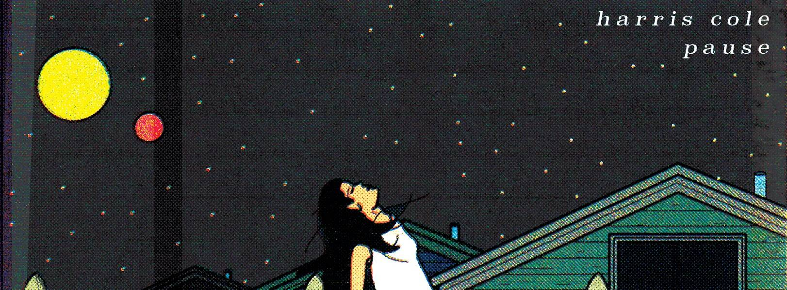

# Rain, Pt. 2

Decent 通过列出 NFT 使艺术家能够从他们的粉丝那里获得资金并与他们建立社区。我们的使命是加速艺术家的成长并帮助他们*拥有*自己的事业。音乐家上传曲目并挑选他们的粉丝收到的版税。艺术家发布代表他们上传歌曲的 NFT，粉丝可以购买这些 NFT 来支持艺术家并分享他们的成功,艺术家在音乐行业面临着巨大的进入壁垒。我们的使命是加速艺术家的成长，帮助他们从职业生涯中获取更多价值。正如流媒体平台使观众民主化一样，我们的目标是通过 Decent 实现所有权和参与民主化。

