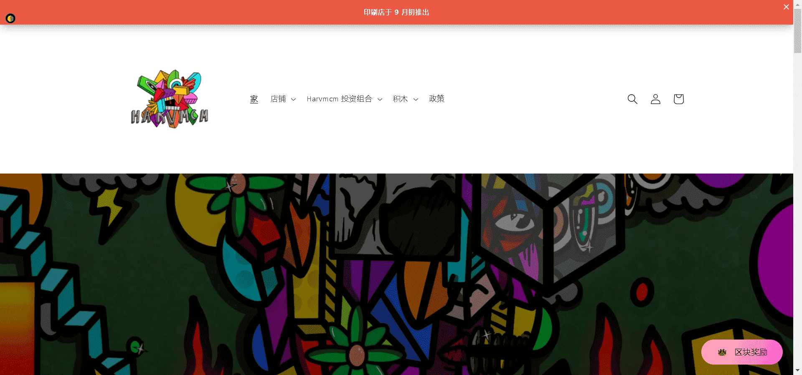

# BLOCKS by harvmcm

BLOCKS 是由 harvmcm 和一系列合作创作的 1000 件独特作品的集合。

▶ harvmcm 的 BLOCKS 是什么？
harvmcm 的 BLOCKS 是一个 NFT（不可替代令牌）集合。存储在区块链上的数字艺术品集合。

▶ harvmcm 代币的 BLOCKS 有多少？
harvmcm NFT 总共有 1,000 个 BLOCKS。目前 576 位所有者的钱包中至少有一个 BLOCKS by harvmcm NTF。

▶ harvmcm 出售的最贵的 BLOCKS 是什么？
harvmcm NFT 出售的最昂贵的 BLOCKS 是 College Dropout。它于 2022 年 6 月 26 日（2 个月前）以 765.1 美元的价格售出。

▶ harvmcm 最近卖出了多少 BLOCKS？
在过去 30 天内，harvmcm NFT 共售出 65 个 BLOCKS。

