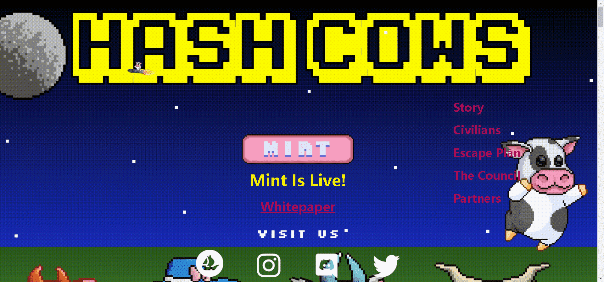

# Hash Cowse

NFTHash Cows 是一个以社区为重点的衍生 NFT 集合，包含 9,999 个 Rare Nft。 每个 NFT 都是使用 140 多种属性（如帽子、眼睛、皮肤等等）的组合通过算法生成的！ Hash Cows 在以太坊 (ETH) 区块链上推出，旨在以可承受的价格提供高质量的艺术品，同时执行广泛的路线图。

但在此之前，必须进行多年的重建和重新学习。这是一条崎岖不平的道路，但最终地球这四个角落的奶牛形成了自己的特质和世界观。这些被称为四个派系。

