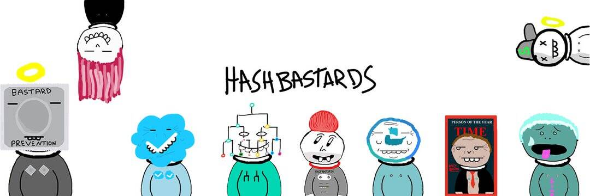

# HashBastards Nip Strips

什么是混蛋？

婊子我抓到你了。

我是HashBastards。HashBastards NFT 的创建者。

模因。消息。笑。历史。
这是 NFTS 的南公园。
NFTS 的纽约每日漫画。

这是一个人的节目。只有我。没有别人了。我全部运行。（无论好坏）

那是杂烩。

**目标：将 Bastards 发展成为一个巨大的品牌。有我们自己的节目。**

如果你是个混蛋，请继续阅读。（我们都有点混蛋，所以请继续阅读）一切开始的地方。
Minted MARCH 2021 (BEFORE BAYC BITCH)
HashBastards 是 Bastardverse 的开始。将这个宇宙建造成巨大的东西的角色。
-- 少于 800 个混蛋
--.012-.015 薄荷 --
持有人的
空投 -- 组合件-- 这简直
是他妈的球手。

在整个 HashBastards 中，有 5 代。
每一代都有自己的主题和自己的组合棋子
如果您拥有两个来自同一世代的混蛋，那么您就有资格获得组合棋子。
BASTARDS 只能在组合件中使用一次。

第一个开始并完成了 Bastardverse 的收集。
以后一切的基础。

