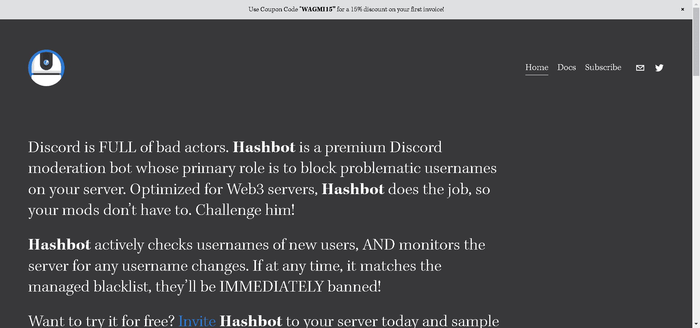

# Hashbot

不和谐充满了坏演员。Hashbot是一个高级的 Discord 审核机器人，其主要作用是阻止服务器上存在问题的用户名。Hashbot针对 Web3 服务器进行了优化，可以完成这项工作，因此您的 mods 不必这样做。挑战他！
Hashbot主动检查新用户的用户名，并监控服务器是否有任何用户名更改。如果在任何时候，它与托管黑名单匹配，他们将立即被禁止！

Hashbot 拯救了我们的服务器！在精神上和情感上帮助我们摆脱了为社区带来不和谐和消除试图利用我们的支持者的机器人所带来的压力。我很高兴 Hashbot 可以保护我们。

