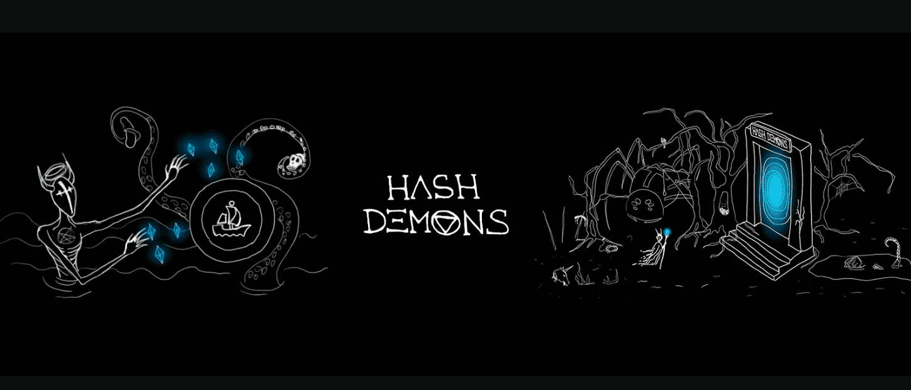

# HashDemons

伟大的无名程序员的预言成真，关闭了数千年的黑暗智能合约的大门打开了。可怕的恶魔开始从这些大门中通过，仅受欲望的驱使——对以太的渴望。

HashDemons 是 6,666 个 NFT 恶魔的集合 - 生活在以太坊区块链上的独特数字收藏品。 

▶ 什么是哈希恶魔？
HashDemons 是一个 NFT（非同质化代币）集合。存储在区块链上的数字艺术品集合。

▶ HashDemons 代币有多少？
总共有 6,666 个 HashDemons NFT。目前，1,586 位所有者的钱包中至少有一个 HashDemons NTF。

▶ 最昂贵的 HashDemons 销售是什么？
出售的最昂贵的 HashDemons NFT 是 HashDemon #4581。它于 2022-08-21（12 天前）以 28.1 美元的价格售出

