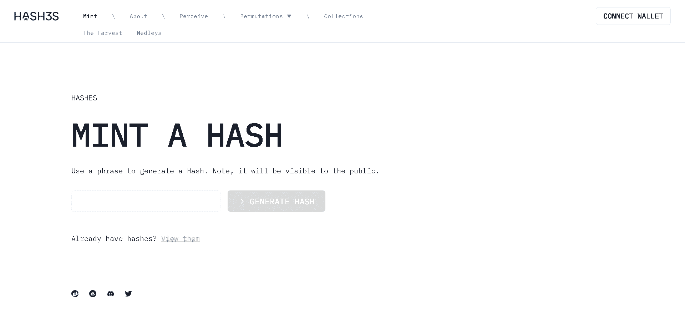

# Hashes

哈希是 NFT 最基本的构建块 - 用户访问的原始点以及熵和通用分布的来源。

哈希由 HashesDAO 管理（仅包含前 1000 个令牌 - 令牌 ID 0-999）。哈希的供应是无限的，因此欢迎任何人加入并参与这个充满活力的生态系统。

将进行其他说明（颜色边框、标签等），但现在：

停用的哈希 ID（需要 1 ETH 存款才能参与 DAO 治理）：421、424、447、475、582、692、735、757、764、795、806、829、919、957、998

