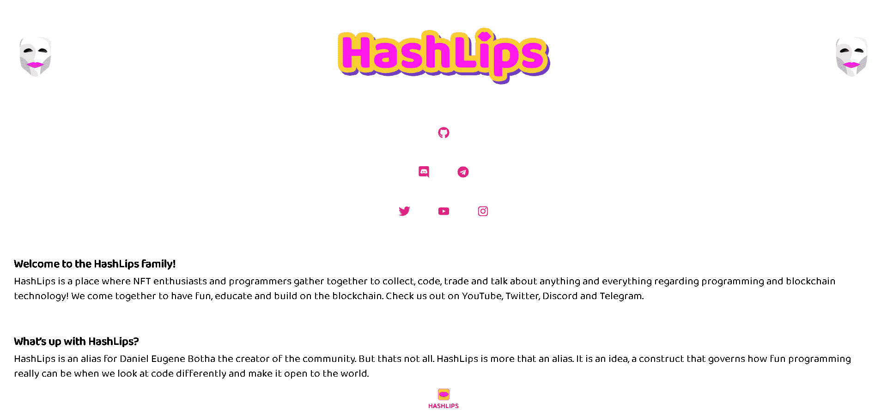

# HashLips Art Engine

HashLips 艺术引擎使艺术家和编码人员能够创建生成的 NFT 集合。该系列旨在突出 Daniel 在创建 HashLips 艺术引擎方面的旅程。HashLips 创建的开源代码被认为是对许多人来说彻底改变了 NFT 空间的 OG 代码库。

这些历史令牌中只有 2500 个存在，因此请将其设为您的个人资料图片，并向世界展示开源代码的力量。

HashLips 是 NFT 爱好者和程序员聚集在一起收集、编码、交易和谈论有关编程和区块链技术的任何事情的地方！我们聚在一起玩得开心，教育和建立在区块链上。

