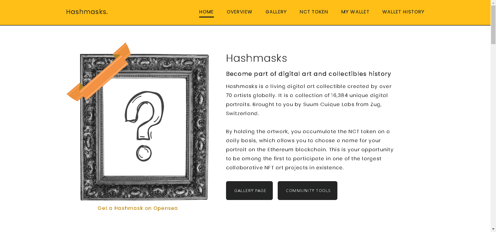

# Hashmasks

Hashmasks 是第一批来到地球的旅行者的古老特征和记忆。他们在这里的旅程漫长而艰辛。哈希掩码在他们到达时忘记了他们的名字。他们留下了线索让我们解开，以便我们发现它们的含义。

Hashmasks 是由全球 70 多位艺术家创作的活生生的数字艺术收藏品。它是 16,384 张独特的数字肖像的集合。由瑞士楚格的 Suum Cuique Labs 提供。

通过持有艺术品，您每天都会积累 NCT 代币，这使您可以在以太坊区块链上为您的肖像选择一个名称。这是您成为第一批参与现有最大的合作 NFT 艺术项目之一的机会。

