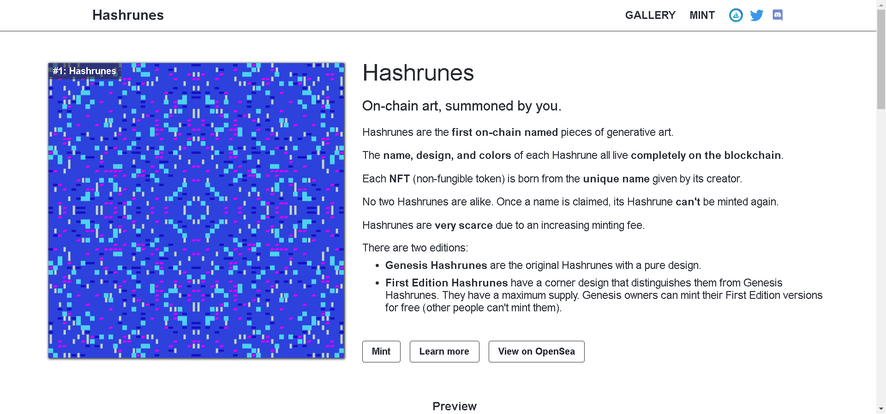

# Hashrunes

链上艺术，由你召唤。Hashrunes 是第一个链上命名的生成艺术作品。每个 Hashrune的名称、设计和颜色都完全存在于区块链上。每个NFT（不可替代代币）都源自其创建者给出的唯一名称。没有两个 Hashrunes 是相同的。一旦一个名字被认领，它的Hashrune就不能再被铸造了。

由于铸币费的增加，Hashrunes非常稀缺。有两个版本：Genesis Hashrunes是具有纯设计的原始 Hashrunes。第一版 Hashrunes有一个角落设计，将它们与 Genesis Hashrunes 区分开来。他们有最大的供应。Genesis 所有者可以免费铸造他们的第一版版本（其他人不能铸造它们）。

