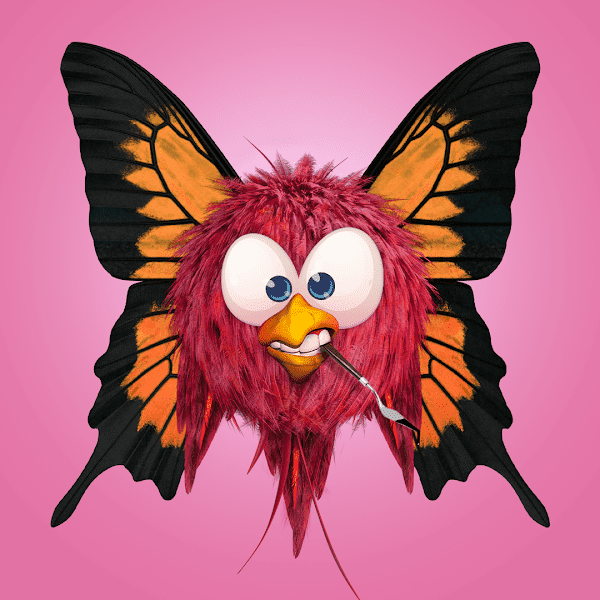

# Hatchlingz

孵化游戏
第一份此类合同
Hatchlingz 的开发旨在为 NFT 社区提供一个完全公平和透明的稀有性和物种分布。所有 Hatchlingz 都从一个蛋开始，有 1/3 的概率孵化，无论是在薄荷上还是在每次出售或购买蛋时。Hatchlingz 元数据将在铸币之前公开存在于云中，并存储在合约内的数组中。每当一个蛋孵化时，它就会选择其中一个物种并孵化到下一个可用的元数据中。

一个孩子的世界，
长大的野心

大雾笼罩着维伦的海洋和风景，扼杀了生命，阻止了新小鸡的孵化。鸟类委员会通过一个传送门将 10,000 只潜在的孵化器发送到一个新世界，以不受腐蚀地孵化。太空旅行无疑会对蛋产生未知的影响，并永远改变维伦斯的历史。

