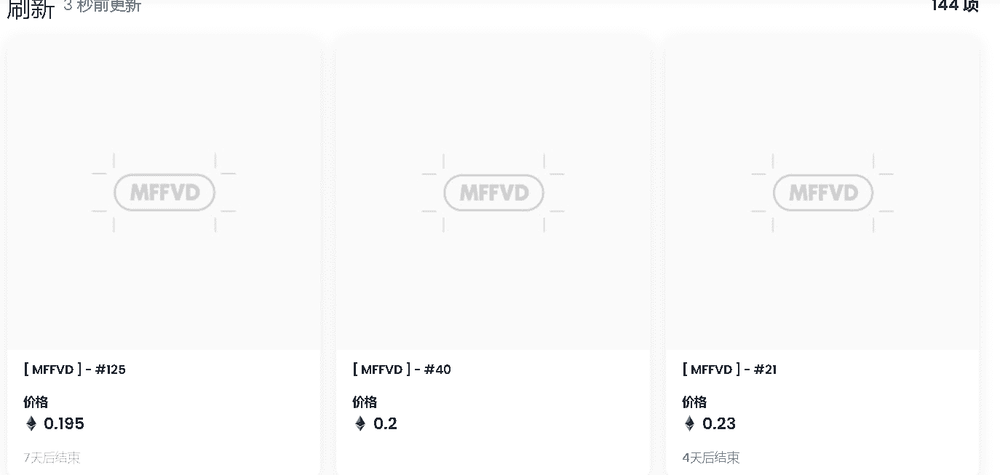

# [ MFFVD ]

▶ 什么是 [ MFFVD ]？
[ MFFVD ] 是一个 NFT（不可替代代币）集合。存储在区块链上的数字艺术品集合。

▶ 存在多少 [ MFFVD ] 代币？
总共有 144 个 [MFFVD] NFT。目前 130 位所有者的钱包中至少有一个 [MFFVD] NTF。

▶ 最昂贵的 [MFFVD] 销售是什么？
售出的最昂贵的 [MFFVD] NFT 是 [MFFVD] - #128。它于 2022 年 6 月 8 日（3 个月前）以 904.5 美元的价格售出。

▶ 最近卖出了多少[ MFFVD ]？
过去 30 天内售出了 10 个 [MFFVD] NFT。

