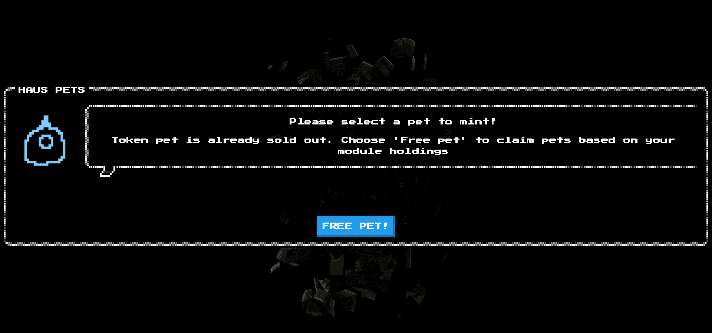

# hauspets

▶ 什么是 hauspets？
hauspets 是一个 NFT（非同质代币）集合。存储在区块链上的数字艺术品集合。

▶ 有多少 hauspets 代币？
总共有 7,208 个 hauspets NFT。目前，3,473 位车主的钱包里至少有一个 hauspets NTF。

▶ 最昂贵的hauspets 销售是什么？
NFT 出售的最昂贵的 hauspets 是 haus.pet [glimsy] 版本 0.04。它于 2022-06-05（3 个月前）以 764.2 美元的价格售出。

▶ 最近卖了多少个hauspets？
过去 30 天内售出了 300 个 hauspets NFT。

