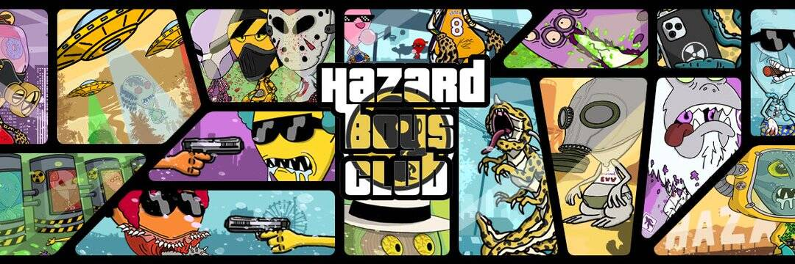

# HAZARDBOYSCLUB

危险男孩俱乐部统计数据
创建于 3 个月前
5,000 代币供应
5% 费用
过去 7 天没有售出 HAZARDBOYSCLUB。

虫洞的意外扩张为我们的银河系创造了一个入口，导致这颗危险的星球被吸入并穿越时空。

危险星球的外星女王已经部署了 10,000 名危险小子，寻找最近的可居住星球……经过长时间的搜索，船员们找到了可居住和探索的肥沃植物。地球。

由于不幸的对地球引力的错误计算，导致对危险的外星飞船失去控制，燃烧地球大气层导致坠毁。

只有一半的船员幸免于难。

政府对不明飞行物 (UFO) 的坠毁事件感到震惊，要求所有士兵俘虏并保护任何活着的对象。

你是士兵。帮助保护地球是你的职责。你行动的结果将对你们星球的未来产生严重后果。武装起来。抓住你的钱包。捕获。你的星球岌岌可危。

