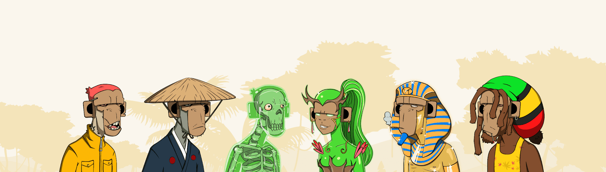

# Haze Monkey Society - Genesis NFT

1,242 只阴霾猴子通过虚拟世界对社会产生影响。在 150 光年外,在埃伦·莫斯克 [原文如此] 创造的名为 Hazron 的实验星球上,一种壮丽的特殊培 育的猴子除了阴霾和寒冷的氛围外,绝对不需要任何东西来生存。在一个一切都是毒品和恒河的 星球上,你能想到的每一种阴霾都存在于哈兹伦。最令人着迷的是雾霭呈现出的多种形态,它们 甚至以高大的棕榈树和美丽的猪的形式存在。
哈兹伦的中心是永恒的库什,一种植物,它是整个宇宙永恒幸福和平衡的唯一来源。这使猴子在 千年来生活在完美的和平、和谐与平衡中。世界和平,这是人类几千年来不可能实现的任务,从 第一天起就在哈兹伦,唯一的原因是永恒的库什,当然还有阴霾。当一个先进的类人文明发动攻 击,摧毁他们的星球并消灭全球近 99% 的人口以寻找永恒的库什时,一切都发生了变化。
最后幸存的雾霾猴物种面临着拯救物种和重建地球的终极挑战,同时还要与无懈可击的敌人作 战。他们得到了来自另一个宇宙的双胞胎物种的支持,但 OG 猴子会成功拯救他们的星球并恢复 Hazron 吗?在我们的项目阵容中找出答案!
准备好迎接元宇宙历史上最疯狂的故事!

