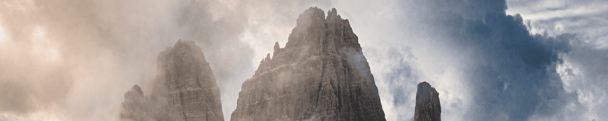

# Head in the Clouds // Edition by Brayden Hall

Brayden 是一位居住在温哥华的生活方式、冒险和旅行摄影师，对探索有着永不满足的渴望。从巴塔哥尼亚史诗般的山峰到毛里求斯郁郁葱葱的热带海滩，您总能找到他在寻找下一次冒险。

经过多年的奉献，他已成为冒险摄影领域的支柱，他花时间连接社区并提升他人。Brayden 以其独特的眼光将风景与户外生活方式融为一体，与谷歌、哥伦比亚、马自达等顶级品牌以及主要旅游局和航空公司合作。

他引人入胜的讲故事通过令人难以置信的地点的图像栩栩如生，这些地点既独特又极具挑战性。Brayden 努力激发和激励人们去了解这个世界所提供的东西，并在做这件事时总是乐在其中。

