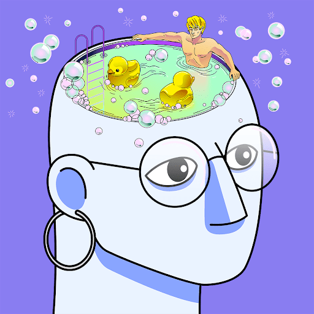

# Head Spaces NFT

“这里的动机和目的其实很简单——通过艺术和团结的方式来提高心理健康意识。我最近经历了一段麻烦的时期，开始这个项目在我的生活中播下了希望和复兴的种子。现在在一个更好的地方，我愿意尽我所能为那些可能需要它的人提供幸福、舒适和庇护。

官方头部空间系列。

该项目展示了错综复杂的线条、复杂的调色板和一个重复的、相关的主题——心理健康。以一种通常无法用语言表达的方式，艺术品旨在描绘不同的情绪、情感和记忆。每个场景都为独特的解释和联系打开了一个窗口。

