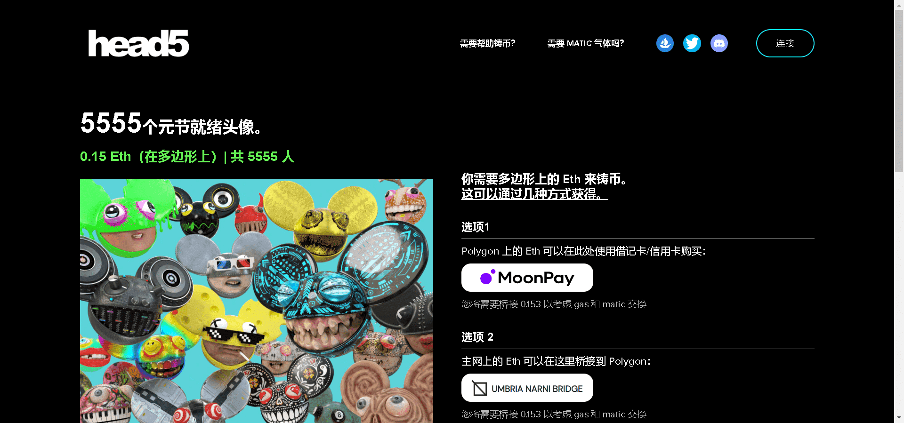

# HEAD5 by deadmau5

在 Polygon 区块链上铸造的 5555 个生成 3D 收藏品，在 400 多个元节集成中具有实用性。

该代币的持有者将继续获得令人兴奋的新 mau5 项目和集成 5ever。

特征是完全随机的，由“头骨”、“眼睛”、“耳朵”和“嘴巴”组成，周围还隐藏着一些有趣的附加物。查看您的 Head5 NFT 的稀有性。

- 在 Polygon 区块链上铸造
- 每铸币最多 5 个 NFT
- 持有者将继续获得令人兴奋的新 mau5 项目和集成 5ever 的奖励。
- 通过 The Sandbox 和 Ready Player Me 在虚拟世界中使用 Head5

