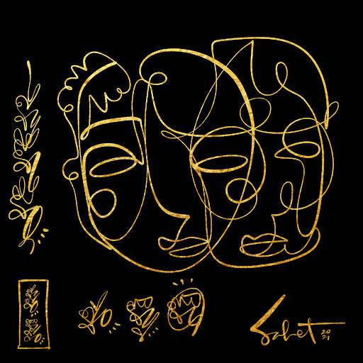

# HEALING CODES

治愈密码
TM值
萨贝特的情书
基于 Ali Sabet 的 333 个手绘治愈代码的 4850 个 NFT 集合。每个治疗代码都将具有内在的效用——因为它们充满了治疗能量。治疗代码也将具有实际用途——我们将与著名的精神领袖和老师一起举办年度治疗研讨会。围绕治疗和健康主题的其他活动也将成为路线图的一部分。2015 年凌晨 3:00，Sabet 在素描时出现了四个独特的爱情符号。这些符号成为他著名的情书的基础，萨贝特将其描述为一种直接从宇宙流到画布上的神秘语言。随着萨贝特的情书在艺术界传播开来，收藏家们描述了与个人治愈密码的深厚情感联系。有些是用中文、日语甚至英语等已知语言阅读的，有些则看到了神秘的日期和名字，而另一些则描述了清晰和治愈的深刻时刻。在这个系列中，Sabet 将分解爱情脚本，并为每位收藏家提供一个代码来指导他们的旅程。

